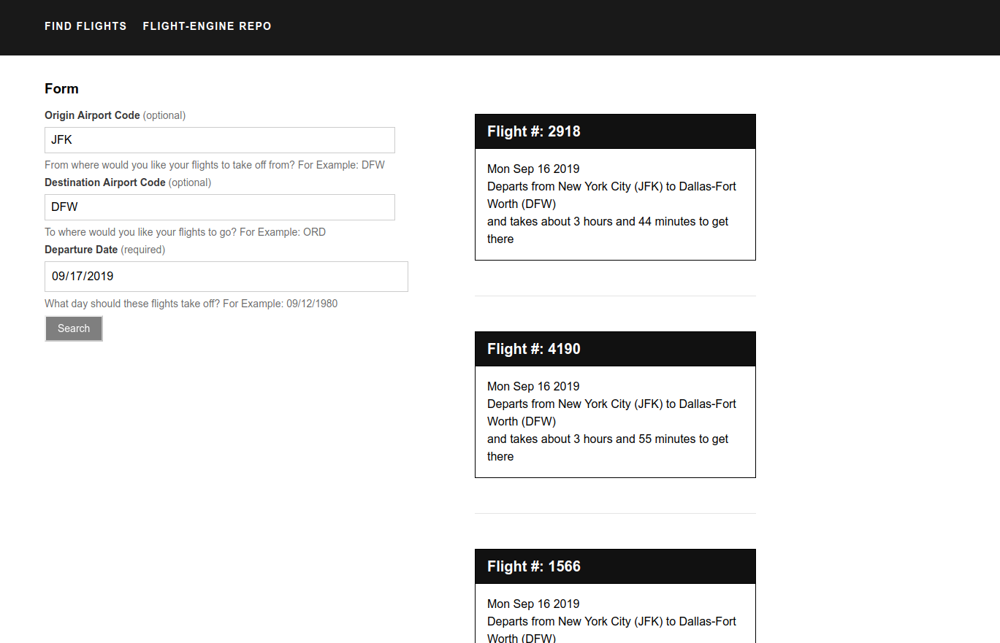

# Web Demo
A Simple Web Application Demonstrating the use of American Airlines' Flight-Engine API

[](https://heroku.com/deploy)

---
**Table of Contents**

- [What does this App look like?](#user_interface)
- [How do I run this App?](#running_this_app)
- [How do I do run the Tests?](#tests_are_the_best)
- [How do I make Network calls?](#network_calls)

---

## What does this App look like? <a name="user_interface"></a>


---
## How do I run this App? <a name="running_this_app"></a>
With ease of course! Before running this app, make sure you've set everything up with the [Flight-Engine](https://github.com/AmericanAirlines/Flight-Engine) and its running on your computer. Below are a few ways you can get started:

- Open the [index.html](index.html) in your favorite browser like Google Chrome, Mozilla Firefox, or if you're really desperate, Safari or Internet Explorer. Prepare to be amazed! Because that's all you have to do.

- Deploy your own version of this app to Heroku by pressing that cool purple button at the top of this document. All you need is to make some free login credentials and you can access the web demo anywhere! 
    
    - For more info, go see how deploying with [Heroku with git](https://devcenter.heroku.com/articles/git) can be a walk in the park

- If you need this deployed with [Node.JS](https://nodejs.org/en/docs/guides/getting-started-guide/) or similar, follow the below steps:

    - Go download the [Node.JS runtime](https://nodejs.org/en/download/) for your specific Operating System. Checkout this [getting started guide](https://nodejs.org/en/docs/guides/getting-started-guide/) if you aren't familiar with working with Node or the [Node Package Manager](https://docs.npmjs.com/about-npm/)
    
    - From your favorite terminal or command prompt, run the below commands one after another:
        ```sh
        $ cd CLONED_WORKSPACE/
        $ npm install
        $ node_modules/harp/bin/harp server --port 4000
        ```
        After running those commands you should see a message saying your server is listening at `http://localhost:4000`. Go ahead and try copy/pasting that into your favorite browser. You should now be able to see and interact with the demo!

---
## How do I run the Tests? <a name="tests_are_the_best"></a>
I'm so glad you asked! Before proceeding to the next steps, be sure to download the [Node.JS runtime](https://nodejs.org/en/download/) for your specific Operating System and checkout this [getting started guide](https://nodejs.org/en/docs/guides/getting-started-guide/) if you aren't familiar with working with Node or the [Node Package Manager](https://docs.npmjs.com/about-npm/)

```sh
    $ npm install # Install all the Node goodies/packages
    $ npm test # Runs all unit tests defined in the directory unit-tests/
    $ npm run uitest # Runs all of the User-Interface or Integration Tests defined in ui-tests/
```
---

## How do I make Network calls? <a name="network_calls"></a>
Join Linkedin today. Not that kind of network! [Checkout this HTTP overview though](https://developer.mozilla.org/en-US/docs/Web/HTTP/Overview), its like totally the bomb dot com! Below are just a few examples of how to make these requests so you can tap in to the thousands of different kinds of resources at your fingertips! Don't believe me? [Checkout this directory of available APIs online](https://www.programmableweb.com/apis/directory) or better yet, think of a subject and slap API at the end of it and see what your favorite search engine spits out.

- The most basic example! But keep in mind, your app would most likely need to run in a browser to use this. [XMLHttpRequest](https://developer.mozilla.org/en-US/docs/Web/API/XMLHttpRequest) is not inherently defined in a Node.JS application. [Here's a workaround for that though](https://www.npmjs.com/package/xmlhttprequest)
    ```javascript
    var data = null;

    var xhr = new XMLHttpRequest();
    xhr.withCredentials = true;

    xhr.addEventListener("readystatechange", function () {
        if (this.readyState === this.DONE) {
            console.log(this.responseText);
        }
    });

    xhr.open("GET", "http://localhost:3030/flights?origin=&date=2019-09-11T04%3A06%3A39.759Z");

    xhr.send(data);
    ```

- A Node.JS example, not tricky but can sometimes be harder to understand what's going on
    ```javascript
    var unirest = require("unirest");

    var req = unirest("GET", "http://localhost:3030/flights");

    req.query({
        "origin": "",
        "date": "2019-09-11T04:06:39.759Z"
    });

    req.end(function (res) {
    if (res.error) throw new Error(res.error);
        console.log(res.body);
    });
    ```
---